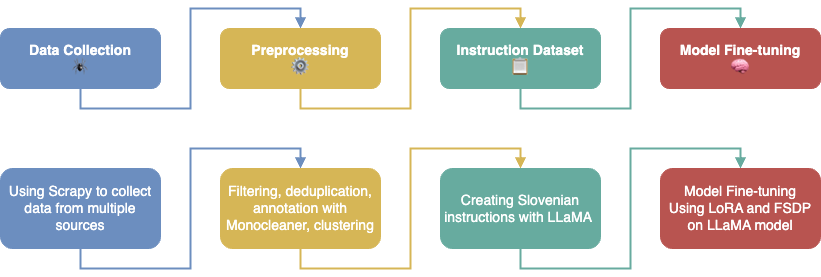

# Natural language processing course 2023/24: `Slovenian Instruction-based Corpus Generation`

test commit

## Team: RANDOM NLP SQUADRON

- Andraž Čeh ([@student8694](https://github.com/student8694))
- Tilen Miklavič ([@tilenmiklavic](https://github.com/tilenmiklavic))
- Tom Sojer ([@tomssojer](https://github.com/tomssojer))

## Project Overview

This project focuses on utilizing Large Language Models (LLMs) to process and execute complex Slovene instructions. The objective is to collect and refine a conversational dataset to improve a multilingual LLM's Slovene performance, responding to the growing use of AI assistants in diverse fields.

## Methodology


### Overview of the Pipeline

### 1. Data Collection
- **Description**: We collect data from multiple online sources to create a diverse and comprehensive dataset.
- **Tool**: Scrapy
- **Process**: Using Scrapy, we scrape various websites such as news portals, forums, and other digital media that are rich in Slovene text.

### 2. Preprocessing
- **Description**: The collected data is preprocessed to ensure quality and relevance.
- **Tasks**:
  - Filtering out short and irrelevant sequences.
  - Deduplication to remove redundant content.
  - Annotation of text sequences based on length and language fluency.
  - Clustering to group similar content for better analysis and processing.
- **Tool**: Monocleaner
- **Process**: We use Monocleaner to detect disfluent sentences and assign fluency scores. Texts are also annotated with quality scores based on their length. Clustering techniques are applied to organize the data into meaningful groups.
  
### 3. Instruction Dataset
- **Description**: We generate a dataset of instruction-following examples in Slovene.
- **Tasks**: Creating high-quality instructions that are contextually relevant to the provided texts.
- **Tool**: LLaMA (Large Language Model)
- **Process**: We use the LLaMA model to generate context-appropriate questions and instructions, ensuring that the generated instructions are relevant to the content.

### 4. Model Fine-tuning
- **Description**: The LLaMA model is fine-tuned using the generated instruction-following dataset.
- **Techniques**:
  - **Low-Rank Adaptation (LoRA)**: Efficiently adapts large pre-trained language models by modifying a select subset of parameters through rank-decomposition matrices.
  - **Fully Sharded Data Parallel (FSDP)**: Optimizes training by distributing the model's parameters across multiple GPUs, reducing memory demands and improving scalability.
- **Process**: The fine-tuning process enhances the model's ability to understand and execute tasks in Slovene, making it more effective for local applications.

## Repository Structure

- `docs/`: Contains all report documents, both source files and PDFs.
- `src/`: Contains the source code for the model implementation and analysis.
- `data/`: Contains all datasets required for model training.
- `presentation/`: Contains the slides for the final presentation.

### Milestones

- [x] [Milestone 1](https://github.com/UL-FRI-NLP-2023-2024/ul-fri-nlp-course-project-random_nlp_squadron/milestone/1)
- [Milestone 2 - 3. 5.](https://github.com/UL-FRI-NLP-2023-2024/ul-fri-nlp-course-project-random_nlp_squadron/milestone/2)
- [Milestone 3 - 24. 5.](https://github.com/UL-FRI-NLP-2023-2024/ul-fri-nlp-course-project-random_nlp_squadron/milestone/3)

## Objectives

- Understand the architecture and capabilities of LLMs.
- Collect and organize a large Slovene conversational dataset.
- Fine-tune a multilingual LLM to improve its conversational abilities in Slovene.

## References

- [Training language models to follow instructions with human feedback](https://arxiv.org/abs/2203.02155)
- [Llama 2: Open foundation and fine-tuned chat models](https://arxiv.org/abs/2307.09288)
- [BLOOM: A 176B-Parameter Open-Access Multilingual Language Model](https://arxiv.org/abs/2211.05100), [Model on Hugging Face](https://huggingface.co/bigscience/bloom)

## How to run Scrapy

It is recommended to use SLING to run the crawler as a lot of compute power is available. Once logged in to the login node, run the command below for the crawler to start working. After the job has ended, the output will be stored in xml files.

```
sbatch run.sh crawler_name
```
